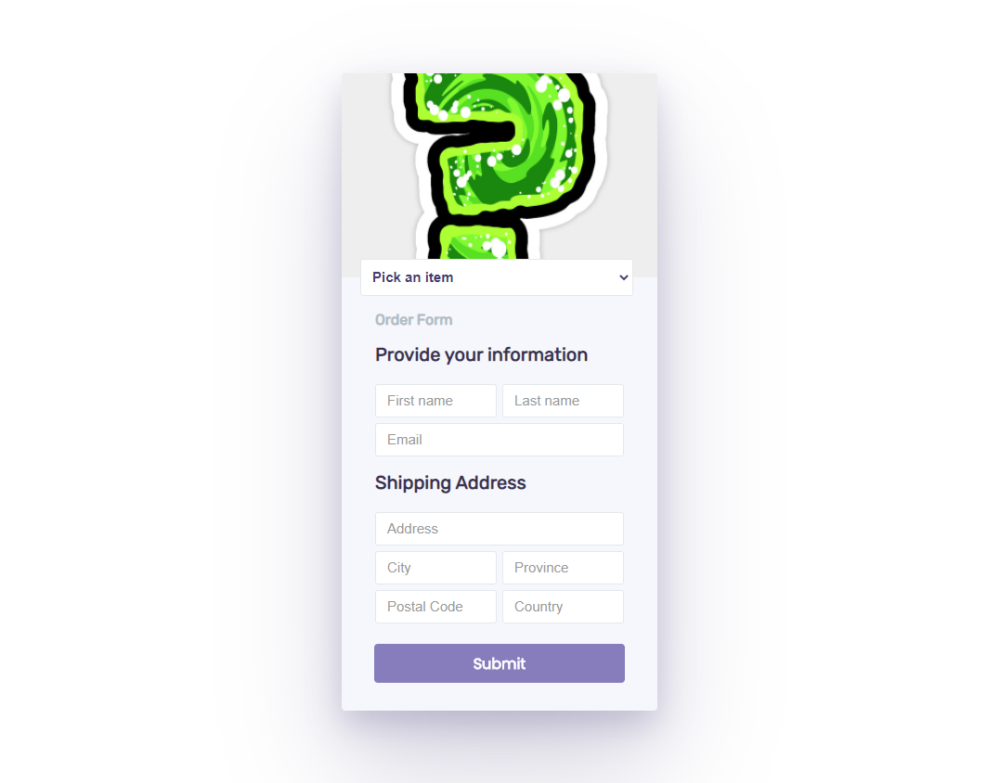

# 4-3 Node.Js: Express Methods

## Setup

There are many ways to set up a full-stack development environment. For the Node module, we will follow this set up provided in this repository.

This repository contains a frontend and a backend folder. This means that each folder is contains a complete environment (`package.json`, `/node_modules`) and are completely independent. You cannot reference code from one environment in the other environment.

Generally speaking, the frontend will query the backend via calls to the server endpoints.

### File Structure

```
├── __lecture
├── __workshop
├── backend
    ├── node_modules (where all external dependencies are saved)
    |   ├── ...
    |   └── ...
    ├── server.js
    └── yarn.lock ("locks" the dependency versions)
├── frontend
    ├── public
    ├── src
    ├── node_modules (where all external dependencies are saved)
    |   ├── ...
    |   └── ...
    ├── package.json (where we keep a record of the app setup)
    └── yarn.lock ("locks" the dependency versions)
├── .gitignore
├── .prettierrc
└── README.md (this file)
```

### The Frontend

1. Open a terminal in VS Code
2. Type `cd frontend`
3. Type `yarn install`

Use `yarn dev:frontend` to start the frontend dev environment.

### The Backend

1. Open _another_ terminal in VS Code
2. Type `cd backend`
3. Type `yarn install`

Use `yarn dev:backend` to start the backend dev environment.

---

## Workshop



## The Order Form

Take a look at the form that is available at [`http://localhost:3000`](http://localhost:3000).

It is an order form for promotional products. Users need to fill out the complete form. All fields are required.

For this exercise, you will need to create the endpoint that this form submits to. You will need to validate the data you receive and respond to the request appropriately.

### Task

To be clear, **you don't need to edit any of the code in `frontend/`**. This work is done for you. Your primary task is to create the server endpoint to process the order. Once your server is complete, the form should work fine.

#### Validation

1. Validate that the user has not yet placed an order (because the product is free, we limit 1 per customer). We cannot know this with 100% accuracy, but we can refuse users

   - whose name is already in our database.
   - whose email is already in our database.
   - whose address matches an address already in our database. Use only the street number and name for this.

2. Validate that the data received is _valid_ as much as is possible.
   - Is the email, an email? Does it include `@`? _(No need to go crazy here. Just a cursory evaluation.)_
3. Validate that delivery address is within Canada. We only ship to Canada!
4. Validate that the item selected is actually in stock.

If any of these validations fail, return an error as a response.

| Error ID          | Description                                        |
| ----------------- | -------------------------------------------------- |
| 'unavailable'     | Item out of stock                                  |
| 'repeat-customer' | Customer has already purchased an item             |
| 'undeliverable'   | Customer didn't supply a Canadian shipping address |
| 'missing-data'    | Some of the required information was not provided  |

The form expects a JSON object as a response. For example, if everything works great:

```json
{
  "status": "success"
}
```

If there is an error, you should change the `status`, as well as provide the error:

```json
{
  "status": "error",
  "error": "unavailable"
}
```

(use the error ID from the table above; for example, if the required data was missing, it should be "missing-data" instead of "unavailable")

### Details

Take a look at `inventory.js` in the `data` folder. This is your _"database"_. It contains current stock levels as well as past customers... Business isn't exactly booming.

You will need to import this data wherever you need to use it. At the top of the file you can require them with

```js
const { stock, customers } = require("<PATH_TO_FILE>");
```

#### Endpoint details

The form makes a POST request to the `/order` path; you will need to create this endpoint in Express.

You don't need to change the front-end at all; it's already set up to send the correct data when the form is submitted, and to handle any error codes.

---

<center>🟡 - Minimally complete workshop (75%) - 🟡</center>

---

### Create a Confirmation Page

Instead of just showing a "Order Confirmed!", render a more complete componend that includes the order information. For example:

> **Thanks for ordering, [name]!**
>
> Your order of [product] will be sent to your home in [province], Canada. Thank you for participating!

To accomplish this, you'll need modify the `ConfirmationMsg` component.

---

<center>🟢 - Complete workshop (100%) - 🟢</center>

---

### Stretch Goals

Some of the validation would be better suited to the frontend. See if you can move some logic to the frontend, so that our backend can rely more on the data it receives.
